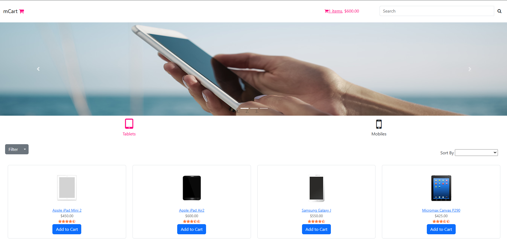

# 🛒 Angular Shopping Cart Application (mCart)

## 📌 Overview

This project is a shopping cart web application developed using Angular.
It demonstrates core Angular concepts like components, services, routing, and UI interactions.

---

## 🚀 Features

* User login functionality
* Product listing
* Add to cart functionality
* Navigation between pages

---

## 🛠️ Technologies Used

* Angular
* TypeScript
* HTML & CSS
* Node.js

---

## ▶️ How to Run

```bash
git clone https://github.com/abdulshadab/angular-mcart-app.git
cd angular-mcart-app
npm install
ng serve --open
```

---

## 🌐 Output

Runs on:
http://localhost:4200

---

## ✨ Improvements

* Customized UI styling
* Cleaned project structure
* Improved readability

---

## 👨‍💻 Author

Mohammed Abdul Shadab
## 📷 Screenshot

